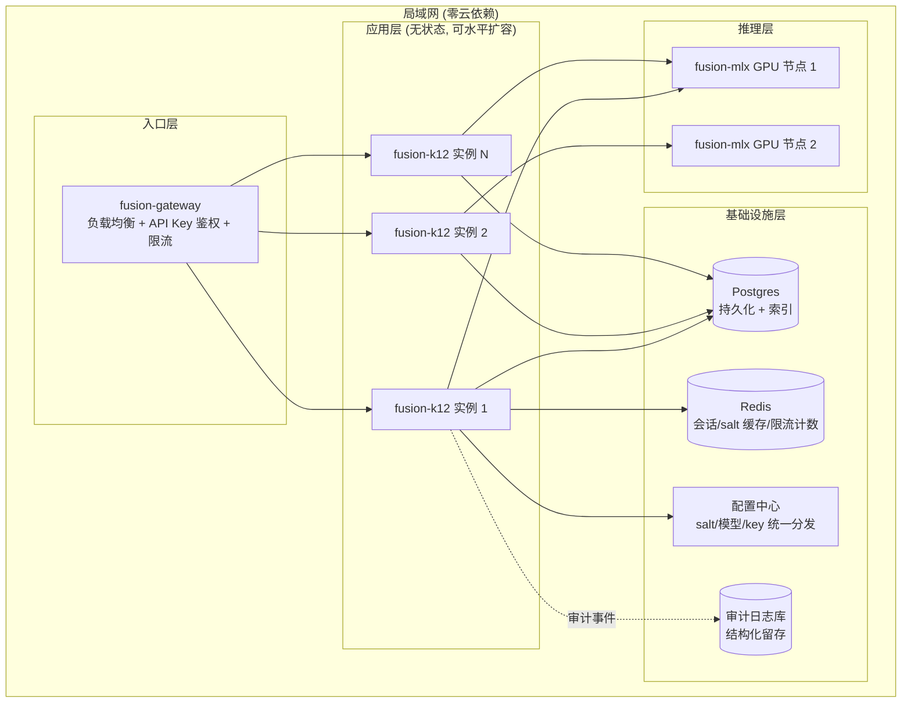
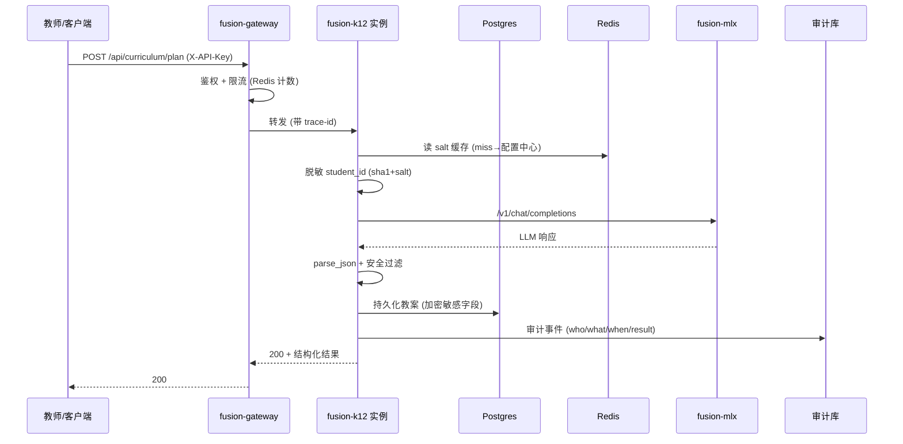

# Fusion-K12-Teacher v2.0 企业级架构升级方案

> 现状: v1.3.0 单机生产就绪, 不达企业级多节点商用标准
> 目标: 升级至企业级集群商用发布
> 范围: 仅 fusion-k12-teacher 工程内改动, 上游依赖走 issue→PR 流程
> 编写日期: 2026-08-30

---

## 一、背景与目标

### 1.1 现状

v1.3.0 经六维度对抗式审计 (功能/架构/安全/性能/容错/运维), P0-P3 全部修复, 单机生产就绪:

- 100% 本地离线, fusion-mlx 推理, 127.0.0.1 闭环
- 295 单测绿, ruff clean, live 测试 32 passed
- 10 引擎 + 11 命令组 + FastAPI + 课标对齐 + 安全过滤 + 脱敏

但企业级多节点商用仍有 7 项设计级缺口 (审计标 acknowledged, 非编码可解):

1. `name_map` 明文落盘 — 脱敏映射可逆且明文, 仅文件权限护
2. 无多节点 salt 统一分发 — 同一学生跨节点 ID 断链
3. scheduler 串行锁 — 多任务并发吞吐受限
4. analytics 无索引线性扫 — 大班级/跨校聚合 O(n)
5. env 运行时不可改 — 改配置需重启
6. 无审计日志留存/合规对接 — 企业追溯缺失
7. 无横向扩缩容/负载均衡 — 单实例瓶颈

### 1.2 v2.0 目标

将 fusion-k12-teacher 从单机应用升级为企业级可商用集群服务:

- **多节点一致**: salt 统一, 学生 ID 跨节点稳定
- **加密存储**: PII 映射加密落盘, 不依赖文件权限
- **可扩展**: 无状态服务 + Postgres + 负载均衡, 水平扩容
- **可审计**: 结构化审计日志, 留存策略, 合规对接
- **可观测**: 指标/告警/配置热更新
- **零数据丢失**: 持久化层迁 DB, 备份/恢复流程

### 1.3 约束

- 仅改 fusion-k12-teacher 工程内代码 (CLAUDE.md 范围规则)
- 上游 (fusion-core/fusion-mlx/fusion-gateway/fusion-memory) 改动走 issue→PR 流程
- 保持本地单机模式可用 — v2.0 双形态: 单机(默认) + 集群(可选)
- 不引入云依赖 — 100% 局域网部署, Apple Silicon 优先

## 二、升级前后对比

| 维度 | v1.3.0 (单机) | v2.0 (企业级) |
|------|--------------|---------------|
| 部署形态 | 单实例 127.0.0.1 | 多实例 + 网关负载均衡 |
| 持久化 | SQLite/JSON 文件 | Postgres (集群) / SQLite (单机回退) |
| PII 保护 | name_map 明文 + 文件权限 | 加密落盘 + KMS/启动注入密钥 |
| salt 分发 | 单机环境变量 | 配置中心统一分发/启动注入 |
| 并发模型 | scheduler 串行锁 | 异步队列 + DB 事务 |
| 数据查询 | 线性扫描 | DB 索引 + 物化视图 |
| 配置变更 | 重启生效 | 热更新 (配置中心轮询) |
| 审计 | 应用日志 | 结构化审计事件 + 留存策略 |
| 可观测性 | 日志 | 指标 + 告警 + 链路追踪 |
| 扩缩容 | 固定单实例 | 基于水位自动伸缩 |
| 数据规模 | 单班 (~百级) | 跨校 (~万级) |

## 三、整体架构 (Mermaid)

### 3.1 集群拓扑



### 3.2 请求与数据流



### 3.3 双形态部署

v2.0 保留单机形态, 通过 `FUSION_K12_MODE` 切换:

- `FUSION_K12_MODE=standalone` (默认): SQLite + 文件 salt + 本地日志, 行为同 v1.3.0
- `FUSION_K12_MODE=cluster`: Postgres + Redis + 配置中心 + 审计库

工厂层按 mode 注入不同存储/缓存/审计后端, 业务层无感。

## 四、六大升级项

### 4.1 持久化层迁移 (SQLite→Postgres)

**问题**: v1.3.0 用 SQLite (scheduler.db) + JSON 文件 (history.json) + 明文 name_map, 无索引, 跨实例不共享, 并发写受限。

**方案**: 抽象 `Repository` 接口, 双后端实现:

```
fusion_k12_teacher/repository/
    base.py          # Repository 抽象基类
    sqlite_repo.py   # 单机后端 (现 SQLite, standalone 模式)
    postgres_repo.py # 集群后端 (asyncpg, cluster 模式)
    factory.py       # 按 FUSION_K12_MODE 选后端
```

**Schema (Postgres)**:

| 表 | 用途 | 关键索引 |
|----|------|----------|
| `lesson_plans` | 教案持久化 | (teacher_id, created_at) |
| `assessments` | 评估记录 | (class_id, subject, grade) |
| `student_profiles` | 学生画像 | (student_hash, subject) |
| `scheduler_jobs` | 调度任务 | (next_run_time), (status) |
| `audit_events` | 审计事件 | (actor, ts), (action) |
| `name_map` | 脱敏映射 (加密) | (name_hash) UNIQUE |

**迁移**: Alembic 版本化迁移, `fusion-k12 migrate` CLI 子命令, 单机→集群一次性导入脚本。

**并发**: scheduler 串行锁→Postgres `SELECT FOR UPDATE` 行锁 + 异步队列, 跨实例任务不重复执行 (DB 去重)。

### 4.2 PII 加密存储 (name_map + salt 统一分发)

**问题**: name_map 明文落盘, salt 各实例 env 独立, 跨节点同一学生 ID 断链。

**方案**:

**加密**:
- name_map 表存 `name_hash` (sha256, 查询键) + `name_encrypted` (AES-256-GCM, 可逆脱敏回查)
- 密钥来源: 启动注入 (env `FUSION_K12_DATA_KEY`) 或文件 (`FUSION_K12_DATA_KEY_FILE`, 600 权限)
- 集群模式: 配置中心统一分发 data_key, 全节点一致
- 单机模式: 本地 keyfile, 行为同 v1.3.0 但加密

**salt 统一**:
```
fusion_k12_teacher/security/salt_provider.py
    SaltProvider (抽象)
    EnvSaltProvider      # 单机: FUSION_K12_SALT env
    FileSaltProvider     # 单机: FUSION_K12_SALT_FILE
    ConfigCenterSaltProvider  # 集群: 配置中心轮询 (TTL 缓存)
```

- 启动拉取 salt, Redis 缓存 (TTL 300s), miss 回源
- salt 轮换: 版本号化 (`salt_v1`, `salt_v2`), 旧值保留用于历史 ID 解析, 新值用于新写入
- 轮换触发: `fusion-k12 security rotate-salt` (管理员), 全节点配置中心通知

**脱敏流程**:
```
name → sha256(name + salt_v{N})[:6] → student_hash (跨节点一致, 不可逆)
name → AES-GCM(name, data_key) → name_encrypted (可逆, 仅管理员回查)
```

### 4.3 多实例部署与负载均衡

**问题**: v1.3.0 单实例, 无水平扩容, 单点故障。

**方案**:

**无状态化**:
- 移除模块级单例引擎状态 → 每请求从 Repository/缓存取, 实例不持有业务状态
- 会话/上下文移至 Redis (会话亲和可选, 默认无状态轮询)
- MLXClient 连接池每实例独立, 经 fusion-gateway 汇聚后分发到 mlx 节点

**网关层 (fusion-gateway, 上游)**:
- 负载均衡: 轮询/最少连接, 健康检查 (`/api/health` 探针)
- 鉴权前移: API Key 校验在网关, k12 实例信任网关透传的已认证标识
- 限流: Redis 令牌桶, 全局 + per-key 双维度
- 注: fusion-gateway 已有负载/鉴权能力 (见 `architecture/Fusion-Gateway-Design.md`), 本工程仅需对接, 上游不足走 issue→PR

**部署**:
- Docker Compose (小规模) / k8s (大规模) 模板
- 实例数 = `FUSION_K12_REPLICAS`, 健康探针 `liveness` (`/api/health` 200) + `readiness` (`/api/ready` 引擎就绪)

### 4.4 审计日志结构化与留存

**问题**: v1.3.0 仅应用日志 (logging), 无结构化审计, 无留存策略, 企业合规追溯缺失。

**方案**:

**审计事件模型**:
```python
@dataclass
class AuditEvent:
    ts: datetime          # 事件时间 (UTC)
    actor: str            # 操作者 (API key hash / 用户标识)
    action: str           # 动作 (lesson.plan / assessment.grade / data.export ...)
    resource: str         # 目标资源 (class_id / student_hash)
    result: str           # success / denied / error
    detail: dict          # 结构化上下键值 (不含 PII 明文)
    trace_id: str         # 链路追踪 ID
    instance: str         # 来源实例 ID
```

**采集**:
- FastAPI 中间件统一埋点, 业务层不分散写审计
- 敏感字段强制脱敏后入审计 (复用 4.2 student_hash)
- 同步写审计库 (cluster) / 本地结构化日志文件 (standalone)

**留存策略**:
- 热数据 30 天 (Postgres `audit_events` 表)
- 冷数据归档 1 年 (parquet/压缩文件, `FUSION_K12_AUDIT_RETENTION` 可配)
- 超期自动清理 (定时任务)

**合规对接**:
- 导出接口 `/api/audit/export` (管理员 key), 支持 JSON/CSV, 时间范围过滤
- 不可篡改: 审计写入用 append-only 表 + 写入时间戳, 删除走单独审批流程并留痕

### 4.5 配置中心与运行时可观测

**问题**: v1.3.0 env 启动读取后不可变, 改配置需重启; 无指标/告警, 故障不可见。

**方案**:

**配置中心**:
```
fusion_k12_teacher/config/
    provider.py       # ConfigProvider 抽象 (get/refresh)
    env_provider.py   # 单机: env 启动读, 静态
    file_provider.py  # 单机: 配置文件轮询 (mtime 变更触发 reload)
    center_provider.py # 集群: 配置中心长轮询/SSE 推送
```

- 可热更新项: `FUSION_MLX_MODEL` (换模型)、`FUSION_K12_RATE_LIMIT` (调限流)、`FUSION_K12_SALT` (轮换, 见 4.2)、日志级别
- 不可热更新项 (需重启): DB 连接串、监听端口、data_key — 启动注入, 改则滚动重启
- 热更新生效: ConfigProvider 后台线程轮询, 变更回调刷新引擎持有的可变配置 (model/限流参数), 不重建引擎

**指标 (Prometheus 风格)**:
- `k12_request_total{route,status}` — 请求计数
- `k12_request_duration_seconds{route}` — 延迟直方图
- `k12_llm_call_total{model,status}` — LLM 调用
- `k12_llm_duration_seconds` — LLM 延迟
- `k12_active_jobs` — 在途调度任务
- `k12_db_pool_inuse` — DB 连接池占用
- 端点 `/api/metrics` (Prometheus exposition format, 管理员 key)

**告警**:
- 基于 Prometheus + Alertmanager (部署侧, 非本工程)
- 本工程提供告警规则模板: LLM 5xx 率 > 5%、DB 池占用 > 80%、调度失败率 > 10%

**链路追踪**:
- 网关注入 `trace-id`, k12 中间件透传至 LLM/DB 调用, 日志/审计均带 trace_id (4.4 已用)

### 4.6 横向扩缩容

**问题**: v1.3.0 固定单实例, 流量突增无弹性, GPU 利用率不均。

**方案**:

**扩缩容信号** (指标来自 4.5):
- 扩容: `k12_request_duration_seconds p95 > 2s` 持续 60s, 或 `k12_active_jobs > 阈值`
- 缩容: 实例平均 CPU < 30% 持续 5min, 且 `k12_active_jobs < 阈值`
- 缩容保护: 最小实例数 `FUSION_K12_MIN_REPLICAS`, 不缩到 0

**探针**:
- `liveness`: `/api/health` 200, 失败重启
- `readiness`: `/api/ready` (引擎+DB+缓存就绪), 失败摘流不杀
- `startup`: 初始等待 (DB 迁移/引擎构建慢), 避免过早判死

**推理层扩容** (上游 fusion-mlx):
- 模型加载耗时长, 扩容慢 — 预热池: 空闲 mlx 节点常驻模型, 流量来即用
- 本工程通过 `FUSION_MLX_URL` 指向网关, 网关按负载分发到 mlx 节点; mlx 扩缩容属上游, 走 issue→PR

**优雅上下线**:
- 上线: ready 探针通过后网关才导流, 避免冷请求 502
- 下线: 收 SIGTERM → 停收新请求 → 等在途完成 (超时 `FUSION_K12_DRAIN_TIMEOUT` 默认 30s) → 退出

## 五、开发任务清单

P = 优先级 (P1 最高), W = 估时 (人天), 依赖 = 前置任务号。

### 5.1 基础设施 (前置)

| # | 任务 | P | W | 依赖 | 说明 |
|---|------|---|---|------|------|
| T1 | Repository 抽象层 + SQLite 后端 | P1 | 3 | — | `repository/base.py` + `sqlite_repo.py`, 现有 SQLite 逻辑迁入, 单测不破 |
| T2 | Postgres 后端 (asyncpg) | P1 | 4 | T1 | `postgres_repo.py`, schema/索引见 §4.1 |
| T3 | Alembic 迁移 + `migrate` CLI | P1 | 2 | T2 | 版本化 schema, `fusion-k12 migrate` 子命令 |
| T4 | Repository 工厂 (mode 切换) | P1 | 1 | T1,T2 | `factory.py` 按 `FUSION_K12_MODE` 选后端 |

### 5.2 安全 (PII/加密)

| # | 任务 | P | W | 依赖 | 说明 |
|---|------|---|---|------|------|
| T5 | AES-256-GCM 加密工具 | P1 | 2 | — | `security/crypto.py`, data_key 来源 env/file |
| T6 | 加密 name_map 存取 | P1 | 2 | T5,T1 | name_hash 查询键 + name_encrypted 可逆, 替换现有明文逻辑 |
| T7 | SaltProvider 抽象 + 三实现 | P1 | 2 | — | env/file/config-center, Redis 缓存 TTL |
| T8 | salt 轮换 + 版本化 | P2 | 2 | T7 | `rotate-salt` CLI, 旧 salt 保留解析历史 |
| T9 | 单机→集群数据迁移脚本 | P2 | 2 | T6 | 明文 name_map→加密, SQLite→Postgres 导入 |

### 5.3 无状态化与并发

| # | 任务 | P | W | 依赖 | 说明 |
|---|------|---|---|------|------|
| T10 ✅ | 移除模块级引擎单例, 请求级取状态 | P1 | 3 | T1 | 实际: 引擎构造后无状态, 仅 cluster 模式跳过 fcntl 单实例锁 + pidfile (允许多实例), 不拆单例 (Rule 2 简化) |
| T11 ✅ | scheduler 改 DB 行锁 + 异步去重 | P1 | 3 | T2 | `Repository.try_lock(task_id,owner,ttl)` reap-then-insert, 同 owner 重入续约, TTL 防死锁; cluster 模式 run_task 抢锁, 被占 skip; standalone 默认放行 |
| T12 ✅ | Redis 缓存/会话后端 | P1 | 2 | — | `cache/` 模块 (CacheBackend ABC + LocalCache 进程内 + RedisCache 异步), `get_cache()` 工厂按 mode 选; 限流 cluster 模式走 Redis INCR 共享计数; redis 进 cluster extras |

### 5.4 可观测与运维

| # | 任务 | P | W | 依赖 | 说明 |
|---|------|---|---|------|------|
| T13 | 审计事件模型 + 中间件埋点 | P1 | 3 | — | `audit/event.py` + FastAPI 中间件, 复用 student_hash |
| T14 | 审计持久化 + 留存/归档 | P2 | 2 | T13,T2 | audit_events 表, 定时归档清理 |
| T15 | 审计导出接口 | P2 | 1 | T13 | `/api/audit/export` 管理员 key, JSON/CSV |
| T16 | Prometheus 指标端点 | P1 | 2 | — | `/api/metrics`, 6 核心指标 §4.5 |
| T17 | ConfigProvider + 热更新 | P2 | 3 | — | env/file/center 三实现, 可变配置后台刷新 |
| T18 | liveness/readiness/startup 探针 | P1 | 1 | T10 | `/api/health` + `/api/ready` |
| T19 | 优雅上下线 (SIGTERM drain) | P2 | 1 | T10 | drain 超时可配 |

### 5.5 部署与对接

| # | 任务 | P | W | 依赖 | 说明 |
|---|------|---|---|------|------|
| T20 | k8s/Docker Compose 集群模板 | P2 | 2 | T18 | replicas/探针/资源限额模板 |
| T21 | fusion-gateway 对接 (负载/鉴权/限流) | P1 | 2 | T10 | 上游已有能力, 本工程对接配置; 不足走 issue→PR |
| T22 | 集群集成测试 + 压测 | P1 | 3 | 全部 | 多实例一致性/故障转移/性能基线 |

**合计**: 22 任务, ~52 人天。

## 六、里程碑与发布节奏

| 里程碑 | 范围 | 任务 | 版本 | 产出 |
|--------|------|------|------|------|
| M1 基础底座 | Repository + 加密 + salt | T1-T9 | v2.0-alpha | 持久化抽象 + PII 加密, 单机模式回归绿 |
| M2 无状态化 ✅ | 单例移除 + 并发 + 缓存 | T10-T12 | v2.0-beta (2.0.0b0) | 多实例可跑, scheduler 跨实例去重, Redis 限流接入, 367 测试绿 |
| M3 可观测 | 审计 + 指标 + 配置热更 | T13-T19 | v2.0-rc | 审计留存, 指标端点, 探针, 热更新 |
| M4 集群发布 | 部署模板 + 对接 + 压测 | T20-T22 | **v2.0** | k8s 模板, 网关对接, 集成测试绿, 商用就绪 |

每里程碑独立可验证, M1 后单机形态仍全功能 (向后兼容硬约束)。

## 七、风险与回滚

| 风险 | 等级 | 缓解 | 回滚 |
|------|------|------|------|
| Postgres 引入运维复杂度 | 中 | standalone 模式仍用 SQLite, 集群可选 | `FUSION_K12_MODE=standalone` 回退 |
| 加密 data_key 丢失 = 数据不可解 | 高 | key 备份 + 启动校验 + 轮换留旧 | 旧明文 name_map 保留至迁移验证完成才删 |
| salt 轮换致历史 ID 断链 | 高 | 版本化 salt, 旧值保留解析 | 回滚 salt 版本号 |
| 无状态化改动面大破坏单机 | 中 | T10 增量改, 每步单测守 | git revert, standalone 模式不变 |
| 上游 gateway 能力不足 | 中 | 先 issue 评估, 缺则 PR 补; 本工程不阻塞 | 临时单实例直连 mlx |
| 性能回退 (DB 抽象层开销) | 中 | M4 压测基线对比 v1.3.0 | 关键路径直查优化 |

**回滚总策略**: v2.0 双形态, `FUSION_K12_MODE` 切回 standalone 即恢复 v1.3.0 等价行为, 数据迁移可逆 (导出脚本)。

## 八、验收标准

企业级商用发布 checklist (全绿才发):

### 8.1 功能完整性
- [ ] 10 引擎 11 命令组全功能, 集群模式行为与单机一致
- [ ] 双形态 (standalone/cluster) 切换零代码改动, 仅 env
- [ ] 单机→集群数据迁移脚本验证通过, 无数据丢失

### 8.2 架构稳定性
- [ ] 多实例随机杀一, 请求自动转其他实例, 无 5xx 持续
- [ ] scheduler 跨实例不重复执行, DB 行锁验证
- [ ] 优雅下线: SIGTERM 后在途请求完成率 100% (drain 超时内)

### 8.3 安全风险
- [ ] name_map 落盘密文, 无明文残留 (grep 验证)
- [ ] salt 跨节点一致, 同一学生 ID 跨实例相同
- [ ] salt 轮换后历史 ID 可解析, 新写入用新 salt
- [ ] API Key 鉴权 + 限流全端点覆盖 (含新增审计导出/指标)

### 8.4 性能瓶颈
- [ ] 跨校万级学生聚合查询 p95 < 500ms (DB 索引验证)
- [ ] 压测: N 实例吞吐 ≈ N × 单实例 (线性扩展, 无共享锁瓶颈)
- [ ] LLM 调用延迟不因集群化劣化 (网关分发均匀)

### 8.5 异常容错
- [ ] DB 短暂断连: 请求降级不崩, 恢复后自愈
- [ ] Redis 断连: salt 回源配置中心, 限流降级为本地计数
- [ ] mlx 节点宕: 网关剔除, 请求转其他 mlx, 不全 502

### 8.6 运维配套
- [ ] `/api/metrics` 指标齐全, Prometheus 可采集
- [ ] 审计事件全关键操作覆盖, 留存策略生效, 导出可用
- [ ] k8s 模板探针/资源/伸缩配置完整, 一键部署
- [ ] Runbook 更新: salt 轮换/data_key 备份/实例扩缩/故障转移/数据迁移

### 8.7 测试
- [ ] 单机模式: 现有 295 单测全绿 (向后兼容)
- [ ] 集群模式: 集成测试 + 多实例一致性 + 故障转移测试绿
- [ ] 压测报告: 性能基线 vs v1.3.0, 达标
- [ ] 安全测试: PII 加密/鉴权/限流/注入回归绿

全绿 → **v2.0 企业级商用可发布**。
